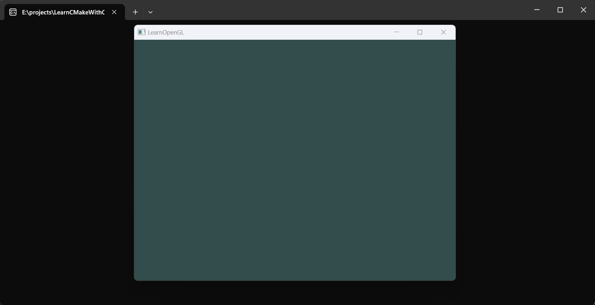

# 你好窗口
环境：
- win11 + vs2022
- cmake 3.29
## 1 测试环境
先确保环境正确。
```cpp
#include <cstdio>

int main() {
  printf("hello world!\n");
  return 0;
}
```

```CMake
cmake_minimum_required (VERSION 3.8)

project ("01_HelloWindow")

add_executable (
	01_HelloWindow 
	src/main.cpp
)
```

## 2 添加 glfw、glad 库
具体项目结构看项目。

安装完 glad 和 glfw 再编译测试。

为了简化目前全部使用静态链接。

### 2.1 添加glad
根据[LearnOpenGL教程](https://learnopengl-cn.github.io/01%20Getting%20started/02%20Creating%20a%20window/)下载源码到项目根目录的3rd下。

先把glad包装成一个**静态库**CMake项目：
```CMake
# 3rd/glad/CMakeLists.txt
cmake_minimum_required (VERSION 3.8)

add_library (
	glad			# 库名，之后 target_link_libraries 使用这个名字
	STATIC			# 这里先使用静态库
	src/glad.c		# 最佳实践手动枚举源码文件
)

target_include_directories(
	glad			
	PUBLIC			# 头文件目录暴露给所有项目
	include			# 头文件目录，省略了./
)
```

根目录CMakeLists.txt下添加：
```CMake
# ./CMakeLists.txt
...
add_subdirectory(3rd/glad)

target_link_libraries(
	01_HelloWindow
	PRIVTAE
	glad
)
...

```
`add_library` 类型有三：
| STATIC(default) | SHARED | INTERFACE |
|:-------:|:-------:|:-------:|
| 静态库 | 动态库 | 不编译，仅暴露配置 |

`target_*` 开头的函数类型有三：
| PUBLIC | PRIVTAE(default) | INTERFACE |
|:-------:|:-------:|:-------:|
| 本项目和引用该项目可用 | 仅本项目可用 | 仅引用该项目可用 |

- 只有链接库、仅头文件库：
```cmake
# 3rd/glad/CMakeLists.txt
cmake_minimum_required (VERSION 3.8)

add_library (
	header_only
	INTERFACE
)

target_include_directories(
	header_only			
	INTERFACE
	include
)

# 仅头文件不需要
target_link_libraries(
	header_only
	INTERFACE
	glad
)
```


### 2.2 添加glfw
同样的根据教程下载源码到3rd，很幸运，这个库提供了CMake配置。

不过可以看到这个库下的CMakeLists.txt有几个选项可以选。

根目录CMakeLists.txt下添加：
```CMake
# ./CMakeLists.txt
...
# 显式配置glfw选项
option(BUILD_SHARED_LIBS "Build shared libraries" OFF)
option(GLFW_BUILD_EXAMPLES "Build the GLFW example programs" OFF)
option(GLFW_BUILD_TESTS "Build the GLFW test programs" OFF)
option(GLFW_BUILD_DOCS "Build the GLFW documentation" OFF)
option(GLFW_INSTALL "Generate installation target" OFF)
add_subdirectory(3rd/glfw-3.4)

target_link_libraries(
	01_HelloWindow
	glad
	glfw
	opengl32
)
...
```

# 3 运行

复制[教程代码](https://learnopengl.com/code_viewer_gh.php?code=src/1.getting_started/1.2.hello_window_clear/hello_window_clear.cpp)到 `main.cpp`

这个时候可以试一下编译运行了。


