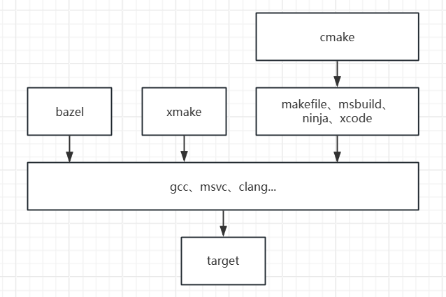

# LearnCMakeWithOpenGL
通过搭建[LearnOpenGL](https://learnopengl-cn.github.io/)环境，学习C/C++Build。



# 推荐使用xmake
使用简单，隐藏了一些细节，开源项目可能断更。

## 模板
```lua
add_rules("mode.debug", "mode.release")

if is_plat("windows") then
	set_runtimes("MD")
	set_toolchains("msvc")
	add_cxxflags("cl::/utf-8")
	add_requires("glfw 3.4", {configs = {shared = true}})
	add_requires("spdlog 1.14.1")
else 
	add_requires("glfw 3.4")
	add_requires("spdlog 1.14.1")
end 

set_languages("c++17")
set_installdir("$(buildir)/install/$(arch)-$(mode)")

includes("3rd/*/xmake.lua")

target("04_xmake")
    set_kind("binary")
	-- 添加第三方库
    add_packages("glfw","spdlog")
	-- 源码添加第三方库
    add_deps("glad","glm", "stb_image")

    add_files("src/*.cpp")
    add_includedirs("src")
	
	-- 复制资源文件
    add_installfiles("(resources/images/*)", {prefixdir = "bin"})
    add_installfiles("(resources/shaders/*)", {prefixdir = "bin"})
    after_build(function (target)
      print("before_build")
      print("copying resource " .." to " .. target:targetdir())
      os.cp(path.join("$(scriptdir)", "resources"), target:targetdir())
    end)

-- header only
target("glm")
  set_kind("headeronly")
  add_includedirs("include", { public = true })
```

## xmake run
会自动加载所有包的环境，再去运行程序。

也就说直接运行程序可能找不到动态库，但是xmake run正常。

# CMake
已成 C++ build tool 标准，每个项目必备。

## 模板
```cmake
# 必须
cmake_minimum_required (VERSION 3.19)

# 必须在peroject前才生效，最好写在CMakeUserPreset.json
# set(VCPKG_TARGET_TRIPLET "x64-linux" CACHE STRING "Vcpkg target triplet")
# set(VCPKG_TARGET_TRIPLET "x64-windows" CACHE STRING "Vcpkg target triplet")
# set(VCPKG_FIXUP_ELF_RPATH TRUE CACHE BOOL "Vcpkg runpath ")
# set(X_VCPKG_APPLOCAL_DEPS_INSTALL TRUE CACHE BOOL "Vcpkg runpath ")

# 必须，这个前后set某些变量有顺序要求
project ("03_vcpkg")

# 判断平台，project后生效
if (CMAKE_SYSTEM_NAME MATCHES "Windows")
elseif (CMAKE_SYSTEM_NAME MATCHES "Linux")
endif()

# C++版本
set(CMAKE_CXX_STANDARD 17 CACHE STRING "The C++ standard to use")
set(CMAKE_CXX_STANDARD_REQUIRED True CACHE BOOL "Whether the C++ standard is required")
set(CMAKE_CXX_EXTENSIONS False CACHE BOOL "Whether to use compiler-specific C++ extensions")

# 只有构建工具是makefile或者Ninja才生效。
set(CMAKE_EXPORT_COMPILE_COMMANDS ON CACHE BOOL "Whether to export compile commands for the project")

# 判断编译器clang,gcc,msvc
if ("${CMAKE_CXX_COMPILER_ID}" STREQUAL "MSVC")
	# 默认
	# set(CMAKE_MSVC_RUNTIME_LIBRARY "MultiThreaded$<$<CONFIG:Debug>:Debug>DLL")
endif()

# 查找包
find_package(glfw3 CONFIG REQUIRED)
find_package(spdlog CONFIG REQUIRED)

# 子项目
add_subdirectory(3rd/glad)

# 生成目标，add_library，add_executable
add_executable (
	${PROJECT_NAME}
	src/main.cpp
  )

# 链接
target_link_libraries(
	${PROJECT_NAME}
	PRIVATE
	glad
	glfw
	spdlog::spdlog
)

# 安装
install(
    TARGETS ${PROJECT_NAME}
    LIBRARY DESTINATION ${CMAKE_INSTALL_LIBDIR}
    ARCHIVE DESTINATION ${CMAKE_INSTALL_LIBDIR}
    RUNTIME DESTINATION ${CMAKE_INSTALL_BINDIR})

```

## 第三方库
和 C++ 类似的多种实现方式，就是没有最佳实践。

| |`add_subdirectory` | `FetchContent` | 包管理 |
|-------|-------|-------|-------|
| 自动下载源码 | × | √ | √ |
| 手动配置 | √ | find_package | find_package|
| 编译产物缓存 | × | × | √ |

- 自动下载源码：自动配置每次都要网络查询更新
- 手动配置：包管理对于选项配置不灵活
- 编译产物缓存：cmake项目通常会删除build导致重新编译

## 缓存
- set(... CACHE ...)
- option
- find_package、find_program、find_library、find_file

很多配置不生效问题，多看看生成目录里的 `CMakeCache.txt` 查看是否已经修改了。

## 功能版本限制
- `include(FetchContent)`：CMake 3.11
- `CMAKE_MSVC_RUNTIME_LIBRARY`：CMake 3.15
- `CMakePreset.json`：CMake 3.19

# 动态库
Window默认会从程序当前目录开始查找，Linux从RPATH开始。

## linux使用动态库开发有点麻烦：
**问题场景**：我想 `cmake --install` 测试实际运行情况。Windows因为从程序当前目录开始查找，所以测试很方便。

### Windows方便点

开启 `X_VCPKG_APPLOCAL_DEPS_INSTALL` dll和exe一起安装。

### 但是Linux就不好说了

要为Vcpkg管理的每个包设置 `-Wl,-rpath,/path/to/your/library`

幸运的是可以开启 `VCPKG_FIXUP_ELF_RPATH`自动设置
```cmake
# vcpkg dynamic library for linux is shit.
# 自动设置
set(VCPKG_TARGET_TRIPLET "x64-linux-dynamic" CACHE STRING "Vcpkg target triplet")
set(VCPKG_FIXUP_ELF_RPATH TRUE CACHE BOOL "Vcpkg runpath ")

# 手动设置
# set(CMAKE_INSTALL_RPATH "${CMAKE_INSTALL_PREFIX}/lib" CACHE STRING "Dynamic library find path")
```

但是运行`cmake --install`安装会把设置好的程序`RPATH` **清空！！**。

### 解决方法

不能和windows一样使用 `X_VCPKG_APPLOCAL_DEPS_INSTALL` 自动复制动态库。

所以要手动把所有so复制到 `/path/to/your/library` 目录。

然后执行指令：`LD_LIBRARY_PATH=/path/to/your/library ./YouAPP`。

## 默认不复制动态库
### 命令复制
```cmake
...
add_custom_command(TARGET ${PROJECT_NAME} 
    POST_BUILD
    COMMAND ${CMAKE_COMMAND} -E copy $<TARGET_FILE:spdlog> "${CMAKE_CURRENT_BINARY_DIR}"
    COMMENT "Copy dll file to ${CMAKE_CURRENT_BINARY_DIR} directory" VERBATIM
)
...
```

### 安装复制
```cmake
...
install(
    TARGETS ${PROJECT_NAME}
    LIBRARY DESTINATION ${CMAKE_INSTALL_LIBDIR}
    ARCHIVE DESTINATION ${CMAKE_INSTALL_LIBDIR}
    RUNTIME DESTINATION ${CMAKE_INSTALL_BINDIR})
...
```

### vcpkg
自动复制到执行文件生成目录。